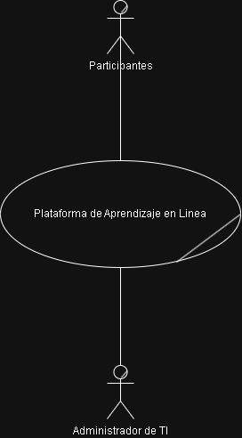
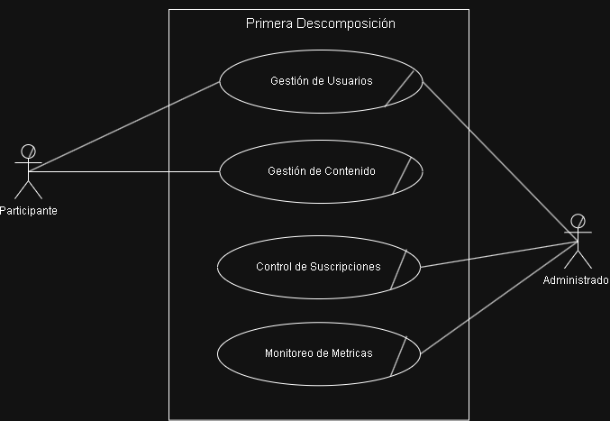

# Core del Negocio — Caso de Uso de Alto Nivel

## Descripcion del Core
La plataforma es un sistema de aprendizaje en línea donde los participantes acceden a recursos educativos digitales mediante una membresía activa. Los usuarios pueden registrarse, contratar un plan y consumir contenido como cursos, talleres, videos, materiales descargables y laboratorios prácticos, mientras el sistema registra su actividad y progreso para ofrecer recomendaciones personalizadas.

El Administrador de TI se encarga de gestionar el catálogo de contenidos, organizándolos por tipo, área de conocimiento y nivel de experiencia, además de supervisar el uso de la plataforma mediante indicadores y estadísticas que apoyan la toma de decisiones.

# Primera Descomposición del Core

Diagrama de la primera descomposición del negocio de alto nivel.

## CU1 - Gestion de Usuarios

## CU2 - Gestion de Contenido

## CU3 - Control de Suscripciones

## CU4 - Monitoreo de Metricas

Te dejo todo en formato listo para copiar y pegar en tu DDA. Ajusta la numeración de escenarios según lo que ya tengas.

***

## Drivers Funcionales

### CU1-1 Registro de Estudiante

| No. RF | Descripción                                                                                                                                                                                                 | Actores Involucrados |
| ------ | ----------------------------------------------------------------------------------------------------------------------------------------------------------------------------------------------------------- | -------------------- |
| RF-001 | El sistema debe permitir el registro de un estudiante capturando nombre completo, fecha de nacimiento, correo electrónico único, contraseña, NIT, número de tarjeta con fecha de vencimiento y fotografía. | Estudiante           |
| RF-002 | El sistema debe validar que el correo electrónico ingresado sea único en la plataforma y cumpla con el formato de correo válido.                                                                  | Estudiante           |
| RF-003 | El sistema debe almacenar la contraseña del estudiante aplicando un mecanismo de cifrado o hash seguro.                                                                                           | Estudiante           |

### CU1-2 Actualización de Datos del Estudiante

| No. RF | Descripción                                                                                                                                                                      | Actores Involucrados |
| ------ | -------------------------------------------------------------------------------------------------------------------------------------------------------------------------------- | -------------------- |
| RF-004 | El sistema debe permitir que el estudiante modifique sus datos personales a través de un panel de configuración.                                                       | Estudiante           |
| RF-005 | El sistema debe permitir que el estudiante actualice sus métodos de pago asociados a su suscripción.                                                                    | Estudiante           |
| RF-006 | El sistema debe validar los datos modificados antes de almacenarlos, mostrando mensajes de error claros cuando la información sea inválida o incompleta.              | Estudiante           |

### CU2-1 Gestión de Suscripciones

| No. RF | Descripción                                                                                                                                                                                        | Actores Involucrados |
| ------ | -------------------------------------------------------------------------------------------------------------------------------------------------------------------------------------------------- | -------------------- |
| RF-007 | El sistema debe permitir que el estudiante contrate un plan de suscripción en modalidad Mensual, Trimestral o Anual.                                                                    | Estudiante           |
| RF-008 | El sistema debe asociar la suscripción activa del estudiante con su método de pago registrado.                                                                                           | Estudiante           |
| RF-009 | El sistema debe mostrar al estudiante la información de su plan actual, incluyendo tipo de plan, fecha de inicio, fecha de vencimiento y estado de la suscripción.                      | Estudiante           |

### CU2-2 Renovación y Cancelación de Suscripción

| No. RF | Descripción                                                                                                                                                                                         | Actores Involucrados |
| ------ | --------------------------------------------------------------------------------------------------------------------------------------------------------------------------------------------------- | -------------------- |
| RF-010 | El sistema debe permitir que el estudiante renueve su suscripción de forma manual antes de la fecha de vencimiento.                                                                       | Estudiante           |
| RF-011 | El sistema debe permitir que el estudiante aplique la cancelación de su membresía en cualquier momento, actualizando el estado de la suscripción.                                         | Estudiante           |

### CU3-1 Reproducción de Contenido

| No. RF | Descripción                                                                                                                                                                                                 | Actores Involucrados |
| ------ | ----------------------------------------------------------------------------------------------------------------------------------------------------------------------------------------------------------- | -------------------- |
| RF-012 | El sistema debe integrar un reproductor multimedia nativo o embebido que permita la visualización fluida del contenido audiovisual educativo.                                                     | Estudiante           |
| RF-013 | El reproductor debe ofrecer controles básicos como reproducir, pausar, avanzar y retroceder el contenido.                                                                                         | Estudiante           |

### CU3-2 Bitácora y Recomendaciones

| No. RF | Descripción                                                                                                                                                                                                                             | Actores Involucrados |
| ------ | --------------------------------------------------------------------------------------------------------------------------------------------------------------------------------------------------------------------------------------- | -------------------- |
| RF-014 | El sistema debe registrar un historial detallado de consumo por cada estudiante, incluyendo al menos el curso visualizado y la fecha de reproducción.                                                                          | Estudiante           |
| RF-015 | El sistema debe utilizar la bitácora de visualización como fuente para generar recomendaciones personalizadas de contenido.                                                                                                     | Estudiante           |

### CU3-3 Página de Inicio del Estudiante

| No. RF | Descripción                                                                                                                                                                                                                                        | Actores Involucrados |
| ------ | -------------------------------------------------------------------------------------------------------------------------------------------------------------------------------------------------------------------------------------------------- | -------------------- |
| RF-016 | Al iniciar sesión con una membresía activa, el sistema debe mostrar en la página de inicio recomendaciones personalizadas basadas en la categoría temática de mayor interés del estudiante.                                              | Estudiante           |
| RF-017 | El sistema debe mostrar en la página de inicio un ranking de los 10 cursos con mayor tráfico en la plataforma.                                                                                    | Estudiante           |

### CU4-1 Gestión de Contenido

| No. RF | Descripción                                                                                                                                                                                                                  | Actores Involucrados   |
| ------ | ---------------------------------------------------------------------------------------------------------------------------------------------------------------------------------------------------------------------------- | ---------------------- |
| RF-018 | El sistema debe permitir al administrador gestionar los tipos de contenido (por ejemplo, Clase grabada, Taller en vivo, Conferencia).                                        | Administrador de contenido |
| RF-019 | El sistema debe permitir al administrador gestionar las categorías temáticas (por ejemplo, Programación, Diseño, Negocios).                                                 | Administrador de contenido |
| RF-020 | El sistema debe permitir al administrador gestionar los niveles de dificultad (Principiante, Intermedio, Avanzado).                                                          | Administrador de contenido |
| RF-021 | El sistema debe permitir el registro y edición de cursos, incluyendo título, año de producción, instructor, resumen breve y descripción completa.                             | Administrador de contenido |

### CU4-2 Dashboard de Contenido

| No. RF | Descripción                                                                                                                                                                                                                                           | Actores Involucrados   |
| ------ | ----------------------------------------------------------------------------------------------------------------------------------------------------------------------------------------------------------------------------------------------------- | ---------------------- |
| RF-022 | El sistema debe permitir al administrador buscar cursos por título y aplicar filtros por tipo, categoría, nivel de dificultad o año de lanzamiento desde un panel de control.                                                                | Administrador de contenido |
| RF-023 | El sistema debe renderizar una gráfica con el Top 3 de categorías con mayor cantidad de reproducciones.                                                                                                                                    | Administrador de contenido |
| RF-024 | El sistema debe renderizar una gráfica con el Top 3 de niveles de dificultad más cursados.                                                                                                                                                  | Administrador de contenido |
| RF-025 | El sistema debe renderizar una gráfica con el Top 10 de cursos más visualizados globalmente.                                                                                                                                                | Administrador de contenido |
| RF-026 | El sistema debe renderizar una gráfica con la distribución cuantitativa de estudiantes según su tipo de suscripción.                                                                                                                        | Administrador de contenido |

### CU5-1 Autenticación en la Plataforma

| No. RF | Descripción                                                                                                                                                         | Actores Involucrados              |
| ------ | ------------------------------------------------------------------------------------------------------------------------------------------------------------------- | --------------------------------- |
| RF-027 | El sistema debe permitir el inicio de sesión de estudiantes y administradores mediante correo electrónico y contraseña.                                    | Estudiante, Administrador         |
| RF-028 | El sistema debe validar las credenciales ingresadas y denegar el acceso cuando sean incorrectas, mostrando un mensaje de error adecuado.                  | Estudiante, Administrador         |

***
